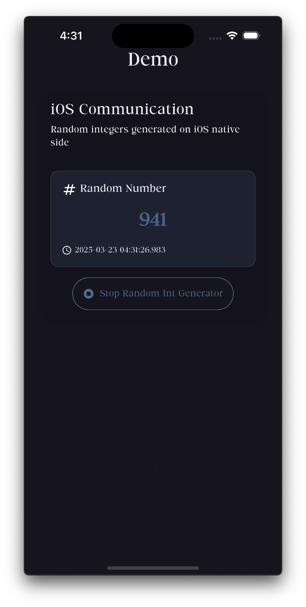

# iOS-Flutter Communication Prototype

This Flutter application demonstrates bi-directional communication between Flutter and native iOS code, implementing a data communication layer that interfaces between iOS and Flutter.

## Features

- Sends commands from Flutter to native iOS code using method channels
- Receives real-time data (random integers) generated on the iOS side via event channels
- Demonstrates clean architecture with BLoC pattern for state management
- Error handling for robust communication
- Multilingual support (English and Japanese)
- Modern UI with animations

## Demo

### Video Demonstration (YouTube Shorts)

<a href="https://www.youtube.com/shorts/4Lap_HX_JbE" target="_blank">
  
</a>

👆 **Click the image above** to watch the short demo video showing the iOS-Flutter communication in action.

Direct Link : https://www.youtube.com/shorts/4Lap_HX_JbE

## Architecture Overview

The project implements a clean architecture approach with the following components:

1. **Presentation Layer (Flutter UI)**
   - Uses BLoC pattern for state management
   - Handles UI updates based on data received from iOS

2. **Communication Layer**
   - Method Channels: For communicating from Flutter to iOS
   - Event Channels: For receiving streaming data from iOS to Flutter

3. **Native iOS Implementation**
   - Swift implementation in AppDelegate
   - Random data generator simulating USB data reception
   - Timer-based data emission to demonstrate real-time communication

### Design Patterns

1. **BLoC Pattern (Business Logic Component)**
   - Separates business logic from UI
   - Provides a structured way to handle state management
   - Facilitates testing and code maintenance

2. **Singleton Pattern**
   - Used for the method and event channels
   - Ensures a single point of access for platform communication

3. **Observer Pattern**
   - Implemented via event channels and stream subscriptions
   - Allows for reactive updates when data is received from iOS

4. **Repository Pattern**
   - Abstracts the data source from the business logic
   - Provides a clean API for the BLoC to interact with

## Communication Flow

1. **Flutter to iOS**:
   - Flutter UI triggers an action (start/stop data generation)
   - BLoC processes the event and invokes the method channel
   - iOS native code receives the method call and performs the requested action

2. **iOS to Flutter**:
   - iOS generates random integers using a timer
   - Data is sent through the event channel
   - Flutter's event channel listener receives the data
   - BLoC processes the received data and updates the UI

## Getting Started

### Prerequisites

- Flutter 3.0.0 or higher
- Xcode 13.0 or higher (for iOS builds)
- iOS 12.0+ device or simulator
- CocoaPods for iOS dependency management

### Installation

1. Clone this repository
```bash
git clone <repository-url>
```

2. Navigate to the project directory
```bash
cd ios_communication_prototype
```

3. Install Flutter dependencies
```bash
flutter pub get
```

4. Install iOS dependencies
```bash
cd ios && pod install && cd ..
```

5. Run the application
```bash
flutter run -d iphone
```

## Project Structure

```
lib/
├── main.dart                    # Application entry point
├── src/
│   ├── app_preferences/         # App preferences management
│   ├── bloc/                    # Business logic components
│   │   ├── ios_communication/   # iOS communication BLoC
│   │   │   ├── ios_communication_bloc.dart
│   │   │   └── ios_communication_response_model.dart
│   ├── core/                    # Core utilities and constants
│   ├── helpers/                 # Helper classes
│   ├── localization/            # Internationalization
│   ├── navigator/               # Navigation management
│   └── view/                    # UI components
│       ├── page/                # App pages
│       └── widget/              # Reusable widgets
```

## Implementation Details

### Flutter Side
- Uses method channels (`com.zanis.ios_communication/method`) to send commands to iOS
- Listens to event channels (`com.zanis.ios_communication/event`) to receive data from iOS
- BLoC pattern handles state management and UI updates

### iOS Native Side
- Implements method channel handlers in Swift via AppDelegate
- Creates a timer to simulate data generation (as a substitute for actual USB data)
- Sends data to Flutter using event channels

## Localization

The app supports both English and Japanese languages. The localization files are located in:
- `lib/src/localization/app_en.arb` (English)
- `lib/src/localization/app_ja.arb` (Japanese)

**Note:** After modifying any ARB files, run `flutter gen-l10n` to regenerate the localization files and make the changes available in the application.

## Debugging and Troubleshooting

When troubleshooting communication issues:

1. **Connection Timeout**: Check that method channels are properly set up and registered on both Flutter and iOS sides.

2. **Data Corruption**: Verify that data serialization/deserialization is consistent between Flutter and iOS.

3. **Integration Failures**: Ensure method channel names match exactly on both sides.

## License

This project is licensed under the MIT License - see the LICENSE file for details.
